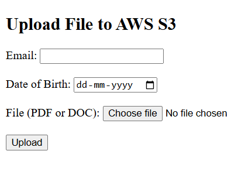
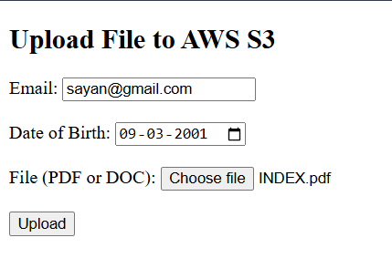
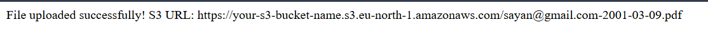

# S3 Node Uploader

## Description 

S3 Node Uploader is a Node.js application that allows
users to upload files seamlessly to an Amazon S3 bucket. This project
simplifies the process of managing and uploading files to cloud storage,
making it efficient for developers and users who work with AWS S3.

## Installation Instructions 

1. Clone the repository to your local
machine using:

    > git clonehttps://github.com/Sayan-Rajak-Das/S3NodeUploader.git

3. Navigate to the project directory:
   
   `bash cd S3NodeUploader`

4. Install all necessary dependencies
 
    `bash npm install`
   
5. Configure your AWScredenti als by creating a .env file and adding the
required keys:

     `makefile AWS_ACCESS_KEY_ID=your_access_key`
     `AWS_SECRET_ACCESS_KEY=your_secret_key`

## Images 

  
 
  
 
 

## Usage

 1. Start the application using:  `node app.js`

 2. Open your browser and navigate to http://localhost:3000.

 3. Follow
    the instructions on the web interface to select and upload files to your
    configured S3 bucket.

## Features

 1. Easy Configuration: Simple setup for connecting to AWS S3 using
environment variables. 
 2. Drag and Drop Uploads: User-friendly interface
with drag-and-drop functionality for uploading files. 
 3. Real-Time
Progress: Visual indicators to show the progress of file uploads. 
 4. Secure and Scalable: Securely manages AWS credentials and efficiently
handles large files.
